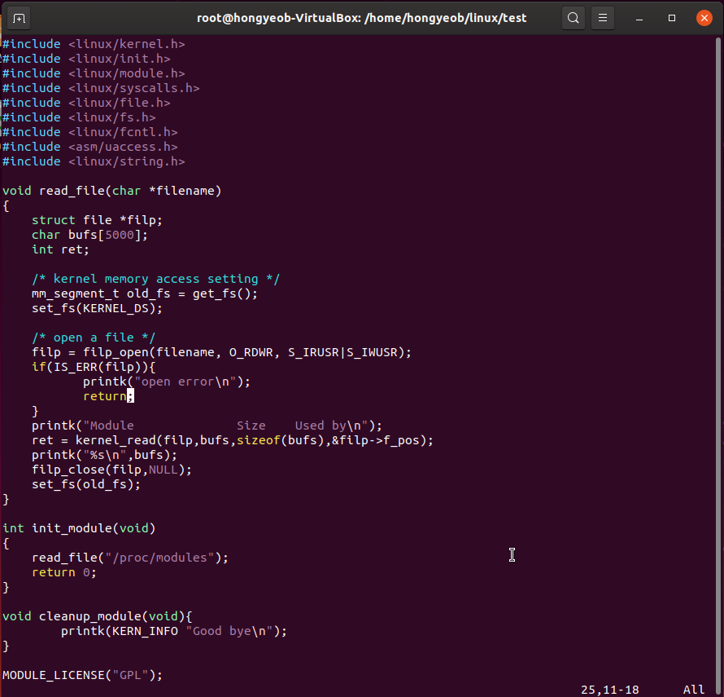

# lsmod
 lsmod is a command on Linux systems. It shows which loadable kernel modules. The lsmod command lists the status of modules inserted in the kernel. Basically, lsmod has no options. It formats the contents of the file/proc/modules, which contains information about the status of all currently-loaded linux kernel modules. If you run lsmod at the command line, you will see three columns of information. Module, size, and used by. Module is the name of the module. Size is the amount of memory used by the resident module, in bytes. Used by contains a number representing how many instances of the module are being used. If the number is zero, the module is not currently being used.

# The objective of this project
 As mentioned above, basically lsmod has no options. It shows the listed status of modules inserted in the kernel. Our team wanted to make it list modules by size with descending and ascending order. We tried to make new system call using C code which is the modification on lsmod and compile in the kernel. If lsmod can arrange modules in order of size, it will be useful in terms of space utilization. Because the user can check the module that takes up a large space and remove it if it is not necessary.

# lsmod.c 
 Our team found C code of lsmod function on the site through an internet search. We failed to compile and execute the code because we didn’t know what the header files were and how to compile them. We tried to modify the code for the main objective of this project. We divided the situation about lsmod into three cases. First of all, the results will be printed regardless of their sorting status if the user enters only the lsmod command without any words. Secondly, if the user enters the lsmod command with ‘-g’, the results will be printed with descending order from biggest to smallest. Thirdly, if the user enters the lsmod command with ‘-l’, the results will be printed with ascending order from smallest to biggest. The rest of the cases are classified as errors, printing an error message and the program will be terminated. The purpose is that the code extracts the size that is located in the middle of the string by reading one line from the file in /proc/modules. The size is converted from string to integer and stored separately in an array and the string which is one line from file is also stored in another array. Using the number of integer arrays, the string array will be printed aligned to the situation by the insertion sort. We tried to make a system call using this code but failed to compile in the kernel.

# Process  
## System call  
 We wanted to make new System call which is functioning like newlsmod.c we made before. we tried several times to make system to show currently loaded kernel modules in order of size, by only using the functions which kernel’s exporting itself,. But all of them were failed. We went through several compile errors because of library problem. Finally, We recompiled the kernel but that didn’t work properly. It felt like too difficult to make executable program in kernel level only by using kernel’s library functions.  
 
### 0. INSTALL AND BUILD LINUX KERNEL
---
  

### 1. Failure of making new system call
---
1. using popen() function - failed: there is no stdio.h which has popen() function in kernel space.  
2. using system() function - failed: we also cannot use stdlib.h building kernel module.  
**->learned point: differnece between user space and kernel space.**  
3. figured out that system() function is consisting of fork() and execl() functions. So we tried to modify system() source code. - failed.  
4. filp_open() and kernel_read()- failed: compile successed but didn't work properly.  

 
### - ALL FAILED

## Module Programming  
 We got to know about module programming. We found out that it lets us make new module and load it dynamically without recompiling whole kernel. It shortened our time to try new codes in kernel level. We succeeded in opening /proc/modules which is basic operating principles of lsmod but failed to list modules by size. We made module file and Makefile. And then we compiled the module.   

## Combining two commands
 We gave up making new system call and module programming. But we found out we can make lsmod to list modules by size just combining two existing simple commands, lsmod and sort.  
	lsmod -l: ‘lsmod | sort -k2 -g’  
	lsmod -g: ‘lsmod | sort -k2 -gr’  
 We can make lsmod -l and -g by just typing the commands like these in the command line. And it gives us exactly what we want: listing modules by size.  
 We just wrote down these short two commands on the .bashrc file to register them as alias permanently. By using these alias, we can make the results only by typing lsmod-l and lsmod-g which is what we wanna do originally.   

# LESSON  
 Although we failed the project, we learned a lot about Operating System while working on this project. These are the lessons we newly learned about.  
### 1. Difference between ‘User space’ and ‘Kernel space’
### 2. What we should consider about when we do programming in kernel space
### 3. How to make system call
### 4. Module programming
### 5. Proc file system

